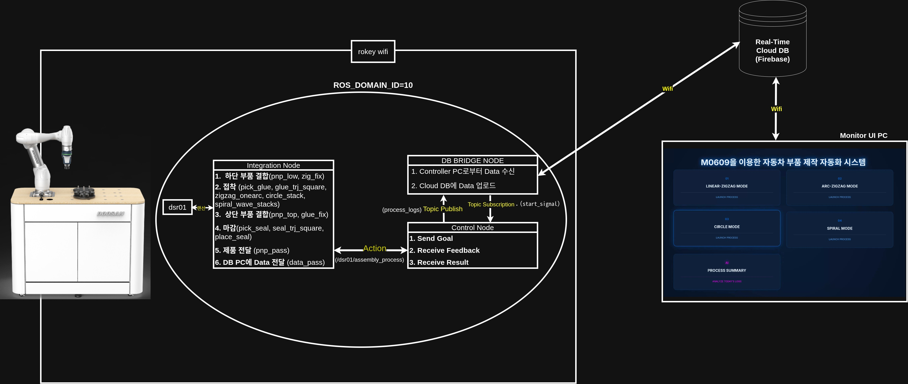
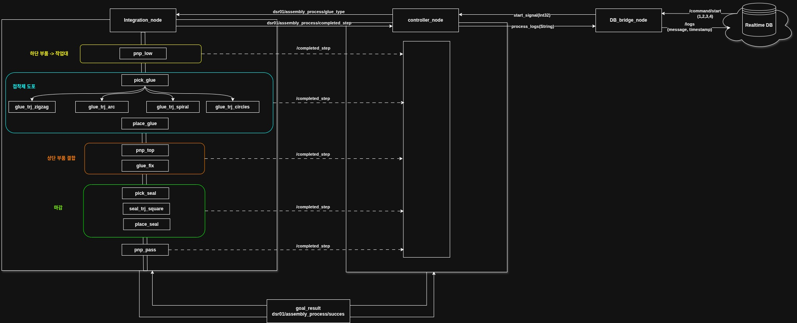
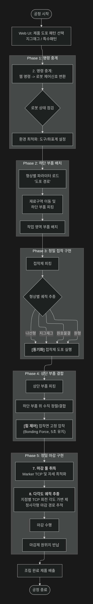
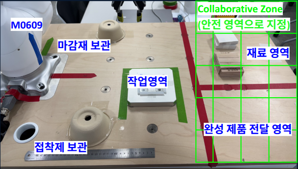

# 🤖 M0609를 이용한 자동차 부품 제작 자동화 시스템

두산 M0609 협동 로봇을 활용한 자동차 부품 제작(조립, 접착, 마감) 자동화 공정 제어 및 실시간 모니터링 시스템입니다. Flask 기반의 웹 UI를 통해 누구나 쉽게 공정을 실시간으로 모니터링하고, Gemini API를 통해 복잡한 공정 로그를 한글로 요약받을 수 있습니다.

## 🛠️ Tech Stack

* **Robot Control**: ROS 2 Humble, Doosan Robotics Library (DR_init, DSR_ROBOT2)
* **Backend**: Python 3.10, Flask
* **Database & Messaging**: Firebase Realtime Database (RTDB)
* **AI Analytics**: Google Gemini 2.5 Flash API
* **Vision**: OpenCV (Live Stream 640x480 for System Monitoring)
* **Frontend**: HTML5/CSS3 (Glassmorphism), JavaScript (ES6+), Firebase SDK

---

## 📂 Project Structure

본 프로젝트는 **ROS 2 패키지**와 **Flask 웹 서버**가 통합된 구조로 설계되었습니다.

```text
.
├── README.md                          # 프로젝트 개요 및 실행 방법
├── 01_cobot1_action_v5                   # [Action] 공정 액션 정의 패키지
│   ├── CMakeLists.txt
│   ├── action
│   │   └── Assembly.action            # 공정 Goal/Feedback/Result 정의
│   └── package.xml
├── 02_cobot1_nodes_v5                    # [Node] 로봇 제어 및 중계 패키지
│   ├── cobot1_nodes_v5
│   │   ├── __init__.py
│   │   ├── control_node_v5.py         # Firebase-Action 중계 및 흐름 제어
│   │   ├── db_bridge_node_v5.py       # ROS 2 토픽 - Firebase 간 브릿지
│   │   └── integration_node_v5.py     # 로봇 실동작 수행 (Action Server)
│   ├── package.xml
│   ├── setup.cfg
│   └── setup.py
├── 03_images                             # 시스템 아키텍처 및 결과물 이미지
│   ├── flow_chart.jpg
│   ├── system_architecture.jpg
│   └── node_architecture.jpg
└── 04_web_ui                             # [Web] Flask 모니터링 서버 소스
    ├── app.py                         # 웹 서버 메인 및 Gemini API 연동
    ├── static                         # 프론트엔드 에셋
    │   ├── script.js                  # Firebase 연동 및 비동기 UI 로직
    │   └── style.css                  # Cyber Navy 테마 스타일시트
    └── templates                      # HTML 템플릿
        ├── index.html                 # 메인 대시보드
        ├── process.html               # 실시간 공정 모니터링 화면
        └── summary.html               # AI 공정 요약 분석 화면

```

### 🏗️ 주요 디렉토리 상세 설명

| 폴더명 | 설명 |
| --- | --- |
| **`01_cobot1_action_v5`** | 로봇의 복합 공정을 정의하는 액션 인터페이스를 포함합니다. |
| **`02_cobot1_nodes_v5`** | Firebase 명령을 로봇으로 중계하고 공정 로직을 수행하는 핵심 노드들이 위치합니다. |
| **`04_web_ui`** | 사용자 인터페이스(UI)를 담당하며, Flask 서버와 Firebase RTDB를 통해 로봇과 실시간으로 통신합니다. |
| **`04_web_ui/ static / templates`** | 웹 대시보드의 시각적 요소와 Gemini API 연동을 위한 프론트엔드 코드가 포함되어 있습니다. |

---

## 📊 System Representing Images

### 1. System Architecture


### 2. Node Architecture


### 3. Flow Chart


---

## 🌟 Key Features

### 1. 4-Gluing-Mode Automated Process

사용자의 선택에 따라 로봇이 네 가지 접착 궤적을 그리며 부품을 조립합니다.

* **Linear-ZigZag**: 직선형 지그재그 도포 공정
* **Arc-ZigZag**: 부드러운 호를 그리는 지그재그 도포 공정
* **Circle**: 정밀한 원형 궤적 도포 공정
* **Spiral**: 나선형 확장 도포 공정

### 2. Real-time Monitoring Dashboard

* **Live Webcam**: 640x480 해상도의 실시간 공정 화면 송출
* **Firebase Sync Logs**: ROS 2에서 발생하는 모든 피드백을 실시간으로 읽어와 대시보드에 업데이트

### 3. AI Process Summary (Powered by Gemini)

* 오늘 하루 동안의 Firebase 로그를 분석하여 생산량을 자동 집계합니다.
* 공정 중 발생한 에러(SAFE_STOP, 실패 등)를 요약하고 개선 제언을 제공합니다.

---

## 🏗️ System Architecture

시스템은 **Client-Mediator-Server**의 3단계 구조로 통신합니다.

1. **Web UI (Client)**: 사용자가 명령을 내리면 Firebase RTDB에 명령에 해당하는 값을 기록합니다.
2. **Control Node (Mediator)**: Firebase의 값 변화 신호를 `start_signal` 토픽으로 수신하여 `Action Client`를 통해 로봇에 명령을 보냅니다.
3. **Integration Node (Server)**: ROS 2 Action Server로서 로봇의 실제 좌표(movej, movel) 및 그리퍼를 제어하고 피드백을 반환합니다.

| Topic / Action Name | Type | Description |
| --- | --- | --- |
| `/dsr01/assembly_process` | `Assembly.action` | 로봇 조립 공정 수행 액션 |
| `start_signal` | `std_msgs/Int32` | 웹 UI -> 컨트롤 노드 명령 전달 |
| `process_logs` | `std_msgs/String` | 공정 피드백 -> Firebase 전송 로그 |

---

## 🚀 Installation & Running

### 1. Requirements

* Ubuntu 22.04 LTS
* ROS 2 Humble
* Python 3.10+ (cv2, flask, firebase_admin, google-generativeai 설치 필요)

### 2. Execution

```bash
# 1. 시스템 실행 (로봇 Bringup & 필요 노드 및 웹 앱 실행)
ros2 launch dsr_bringup2 dsr_bringup2_rviz.launch.py mode:=real host:=192.168.1.100 port:=12345 model:=m0609
ros2 run 02_cobot1_nodes_v5 integration_node_v5
ros2 run 02_cobot1_nodes_v5 control_node_v5
ros2 run 02_cobot1_nodes_v5 db_bridge_node_v5
python3 04_web_ui/app.py

# 2. Flask 웹 서버 실행 (GEMINI_API_KEY 설정 필수)
export GEMINI_API_KEY='your_api_key_here'
python3 app.py

```

### 3. 사용한 기타 장비 목록
- 웹캠, 노트북

### 4. 시스템 환경 공간 구성


---

## 👤 Developer

### Doosan ROKEY 6기 C-2조 
- Development Period : 2026.01.27 ~ 2026.02.09

| 성명 | 역할 | 담당 업무 |
| --- | --- | --- |
| **송서영** (팀장) | UI/DB & 모션 개발 | UI 개발 및 Firebase 연동, 모션 개발 (`pnp_low`, `pnp_top`, `glue_fix`) |
| **조장희** | UI/DB & 모션 개발 | UI 개발 및 Firebase 연동, 모션 개발 (`seal_trj_square`) |
| **이조광** | 모션 & 미디어 | 모션 개발 (`glue_trj_square`), 프로젝트 소개 영상 편집 |
| **안중현** | 모션 개발 | 모션 개발 (`pick_glue/seal`, `place_glue/seal`, `pnp_pass`, 접착 모션) |
---


